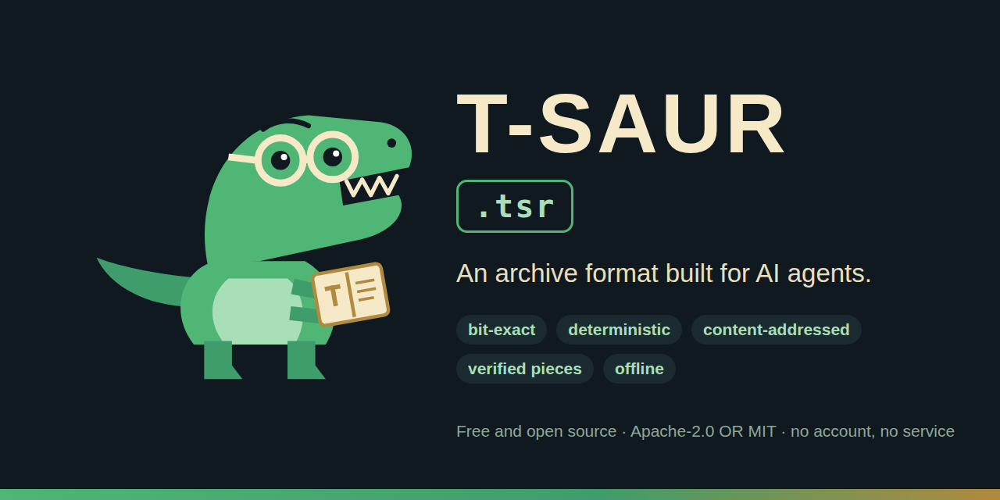

<p align="center">
  <a href="https://github.com/iulianbondari/t-saur"></a>
</p>

# T-saur (`.tsr`) — an archive format built for AI agents

[](https://github.com/iulianbondari/t-saur/actions/workflows/ci.yml)
[](LICENSE-APACHE)
[](docs/spec/TSAUR-FORMAT-SPEC-v1.0.md)
[](CHANGELOG.md)
[](https://crates.io/crates/tsaur)
[](https://docs.rs/tsaur-core)

**T-saur** is a free, open-source archive format (`.tsr`) and command-line archiver, written in Rust, for files that
people and AI agents need to list, search, read and verify without unpacking them. Archives are content-addressed
(BLAKE3) and deterministic; authenticated encryption with post-quantum recipients, signatures, offline N + M recovery
volumes and a built-in Model Context Protocol server are optional parts of the same binary. Format v1 is frozen; the
current version is 1.0.0-rc.1, published on crates.io, with no tagged release or binary package yet
(`ROADMAP.md`, "Step 0").

In more detail, T-saur is a new archive format and archiver designed for AI agents first: information-based
compression (content-defined chunking with deduplication, shared dictionaries and external references,
container-aware recompression, per-block codec choice with branch filters for machine code, canonical text views for
agents), distribution in verifiable pieces (BLAKE3 Merkle trees, erasure coding; direct exchange between two
instances, without discovery, tracker or DHT in v1), and modern cryptography (per-blob AEAD, envelope keys, hybrid
post-quantum recipients, signatures). Agents talk to it through a JSON CLI or the built-in Model Context Protocol
server.

The project is free and open source (Apache-2.0 OR MIT, at your option); nothing in it depends on an account, a
service or a network. It is written and maintained by Iulian Bondari, who holds its copyright, with substantial AI
assistance, which is stated plainly in `AUTHORS.md` and `docs/PROVENANCE.md`. Former working name: *AIX*, replaced
because of IBM's AIX® trademark. Collaboration and questions: contact@iulianbondari.com (security reports: see
`SECURITY.md`).

Start here: `docs/INSTALL.md` (packages, building from source), `docs/GUIDE.md` (first archive, volumes, transfers),
`docs/V1-CONTRACT.md` (what v1.0 promises and how it is checked), `SECURITY.md` (what the reader guarantees, how to
report), `CONTRIBUTING.md` and `CODE_OF_CONDUCT.md`.

**Contents:** [Status](#status-100-rc1-release-candidate) ·
[When to use it, and when not](#when-to-use-it-and-when-not) · [Quick start](#quick-start) ·
[For AI agents: the MCP server](#for-ai-agents-the-mcp-server) ·
[How it differs from ZIP, 7z, RAR and tar + zstd](#how-it-differs-from-zip-7z-rar-and-tar--zstd) ·
[What the measurements show](#what-the-measurements-show) · [Questions and answers](#questions-and-answers) ·
[Repository layout](#repository-layout) · [Security](#security) · [License](#license)

## Status: 1.0.0-rc.1 (release candidate)

Format v1 is frozen and the candidate is functional: bit-exact archiving and restoration, safe listing and
extraction of untrusted archives, offline volume sets with parity, direct exchange between two instances (plain or
pinned TLS), agent operations with the MCP server, two build configurations. What v1.0 promises, and how each promise
is checked, is in `docs/V1-CONTRACT.md`; how to use it, in `docs/GUIDE.md`; what each build reads and which one to
download, in `docs/DISTRIBUTION-POLICY.md`. Verified so far on Windows 11 x64 and Linux x64, by the producer of the
code (`docs/V1-CONTRACT.md` §5; macOS runs the CI matrix only); conditions still open before a public 1.0.0 are
listed in `ROADMAP.md` ("v1.0 gate").

**What is encrypted.** An archive is encrypted only when packed with `--password` or `--to recipient.pub`
(XChaCha20-Poly1305 per blob, Argon2id and/or hybrid X25519 + ML-KEM-768 recipients, optional Ed25519 signature);
otherwise its content, file names and hashes are readable by anyone who holds the file, its volumes or its pieces.
`volumes serve/fetch --tls-identity` encrypts the connection between two instances, not the archive.

## When to use it, and when not

T-saur fits when (each point is a v1.0 promise, `docs/V1-CONTRACT.md` §1):

- files inside an archive must be listed, searched, read by line or byte range, or cited, without extracting them,
  from a shell or from an agent over MCP (P6; `docs/GUIDE.md` §6);
- the same inputs must always give the same archive bytes, and every restored byte must be hash-verified (P1, P2);
- a collection has many versions of the same documents: chunk deduplication, delta coding and incremental archives
  by reference (`pack --ref`) store only what is new (measurements below);
- an archive must survive the loss of some of the drives it is spread over (`volumes split`, any N of N + M) or
  move between two machines you control, over pinned TLS (P4, P5);
- encryption is needed without any service: passphrase or hybrid X25519 + ML-KEM-768 recipients, per-blob
  authenticated (P7, P9).

T-saur is not the right tool, today, when:

- the archive must open in other software: `.tsr` is its own format (`docs/spec/TSAUR-FORMAT-SPEC-v1.0.md` §3), the
  Rust reference implementation is the only reader, and a conformance suite for other implementations is a roadmap
  item (`ROADMAP.md`, "Ecosystem");
- symbolic or hard links must be preserved: links are skipped when packing and never created when unpacking
  (`docs/V1-CONTRACT.md` §3);
- an archive must be updated in place, or you need peer discovery, NAT traversal, a GUI or shell integration: all
  explicitly outside v1.0 (`docs/V1-CONTRACT.md` §3; in-place update is answered by `tsaur update` in roadmap 1.2);
- executables are most of the input: 7-Zip's BCJ2 still leads by 1–2 points (measurements below);
- an independently reviewed implementation is required: every check so far was run by the producer of the code
  (`docs/V1-CONTRACT.md` §6), the outside review is an open item of the v1.0 gate (`ROADMAP.md`), and macOS is
  covered by CI but not declared verified (`docs/V1-CONTRACT.md` §5).

## Quick start

Release packages (`tsaur-<version>-<platform>-lite.zip`; the full build with Lepton JPEG recompression is built
from source, see `docs/DISTRIBUTION-POLICY.md`) contain the binary, this documentation and the licenses; `docs/GUIDE.md` walks through packing,
verifying, restoring, volumes and transfers, and every command in it is executed by `tools/check_guide.py` before a
release. The crates are on crates.io (`tsaur`, the command-line tool; `tsaur-core`, the library), so with Rust 1.87
or newer and a C toolchain (`docs/INSTALL.md`) one command installs the binary; no binary package exists yet (that
comes with the first version tag, `ROADMAP.md`, "Step 0"):

```bash
cargo install tsaur                         # full build; add --no-default-features for the lite build
```

or from a clone of this repository:

```bash
cd tsaur
cargo build --release                       # full build; add --no-default-features for the lite build
./target/release/tsaur pack demo.tsr ../benchmarks/corpus/*          # 64 KiB chunks, 1 MiB blocks, best codec per block
./target/release/tsaur list demo.tsr --md                            # Markdown view with token estimates
./target/release/tsaur info demo.tsr                                 # sections, codecs, filters, chunks, blobs, refs
./target/release/tsaur grep demo.tsr "merkle" --entries "*.md"       # search without extracting
./target/release/tsaur read demo.tsr report-A.docx --view canonical  # DOCX -> Markdown, PDF -> text
./target/release/tsaur verify demo.tsr --json
./target/release/tsaur unpack demo.tsr restored/ --entry "*.pdf"
```

Options worth knowing: `--no-lepton` (full build: store JPEGs as they are, so that the lite build can open the
archive), `unpack --overwrite` (existing files are never replaced without it), `--solid 8` (bigger blocks, best
ratio), `--granular` (one chunk per blob, random access per chunk), `--codec zstd --level 9` (fast mode), `--effort 3`
(`--codec best` with the codec chosen on a sample of each block: 0.8–1.3× the CPU time of `--codec zstd` within
0.4 point of the full trial, which costs 2–2.2×; the default `--effort 5` tries every codec on every block), `--ref
base.tsr` (store only what
`base.tsr` does not already hold),
`--canonical` (hybrid fidelity: also store the Markdown/text view of every DOCX and PDF under `.tsaur/views/`, with
token estimates, so agents read documents without converting; corpus A grows from 62.2 % to 65.4 % for 4 views),
`--password` / `--to recipient.pub` / `--sign-key`, `--pieces` (transport pieces + Reed-Solomon parity sidecars).

### Offline volume sets: spread an archive over drives

```bash
tsaur volumes split demo.tsr --data 4 --parity 2 --out /media/usb1 --out /media/usb2 --out /media/usb3 --out /media/usb4 --out /media/usb5 --out /media/usb6
tsaur volumes inspect /media/usb1 /media/usb3 /media/usb4 /media/usb6 --verify   # which volumes are there, can the archive be rebuilt?
tsaur volumes join demo.tsr /media/usb1 /media/usb3 /media/usb4 /media/usb6      # any 4 of the 6 volumes rebuild it bit-exact
tsaur volumes repair /media/usb1 /media/usb3 /media/usb4 /media/usb6 --out /media/usb7   # recreate the two lost volumes
```

Every volume carries the whole descriptor (archive hash, geometry, the hash of every piece), so there is no index
file to lose; a damaged header or trailer does not disable a volume, a damaged piece counts as one erasure of its
stripe, and `join` refuses to write anything it cannot verify against the archive hash. The piece size adapts to the
archive (64 KiB for the 957 KB benchmark archive: 158 % of its size in 4+2, where parity alone is 150 %; a fixed 1 MiB
piece would have cost 329 %). Everything is offline: no account, server, key service or blockchain is involved.
Design, measured overhead and failure cases: `docs/design/VOLUME-SETS.md`.

Two instances can also exchange pieces directly, with addresses you supply (no discovery, tracker or DHT):

```bash
tsaur volumes keygen --out server.key         # once per machine: prints the fingerprint the other side pins
tsaur volumes serve /media/usb1 /media/usb3 --listen 192.168.1.10:7407 --expose-lan \
      --tls-identity server.key --allow <client fingerprint>                    # on the machine that has volumes
tsaur volumes fetch --set <set id> --descriptor <descriptor hash> --from 192.168.1.10:7407 \
      --peer-id <server fingerprint> --tls-identity client.key --out ./here --join demo.tsr
```

The receiver verifies the descriptor against the identity it already knows and every piece against the descriptor
before writing it; interrupted fetches resume, and on resume every piece already on disk is hash-checked again rather
than trusted from the progress map. `serve` listens on loopback by default; exposing it needs `--expose-lan` *and* a
statement of who may fetch: `--tls-identity` with `--allow <fingerprint>` (TLS 1.3 with self-signed certificates that
each side pins by fingerprint: no certificate authority, account or service; the fingerprint travels through the same
trusted channel as the set id, and a mismatch ends the handshake before any request) or the explicit `--allow-anyone`.
Every connection runs under a time budget and every source address under a request rate; `--max-bandwidth-kib` caps
what the server sends in total and `--max-peers` the distinct addresses it serves at once. `--revoke FILE` on either
side refuses a fingerprint even when it is pinned or allowed, and `--allow-set <set id>=<fingerprint>` admits a client
to one set only (the others are answered like unknown sets). Trust contract and limits: `docs/design/VOLUME-TRUST.md`,
`docs/design/VOLUME-SETS.md` §8.

### Python prototype and benchmark scripts

Python prototype and benchmark (Python 3.12+ with `zstandard`, `cbor2`, `PyNaCl`, `numpy`, `python-docx` and `PyMuPDF`;
PyMuPDF is AGPL-licensed and used only by the corpus builder, never by the Rust implementation):

```bash
python benchmarks/build_corpus.py
python prototype/bench.py
python benchmarks/build_extra_corpora.py   # optional real-world / x86-64 / ARM64 corpora (not redistributed)
python benchmarks/bench_rust.py
```

## For AI agents: the MCP server

`tsaur mcp` serves the same operations over the Model Context Protocol on stdin/stdout. It speaks both the current
per-request versioning (revision 2026-07-28, `server/discover`) and the legacy `initialize` handshake, so clients of
either protocol era can use it. Archives can only be opened below the directories given with `--root` (default: the current directory).

```bash
claude mcp add tsaur -- /path/to/tsaur mcp --root /data/archives
```

or, in a generic client configuration:

```json
{"mcpServers": {"tsaur": {"command": "tsaur", "args": ["mcp", "--root", "/data/archives", "--archive", "/data/archives/corpus.tsr"]}}}
```

Tools: `tsaur_info`, `tsaur_list`, `tsaur_stat`, `tsaur_read` (byte or line ranges, canonical views, binary content as
base64, a citation URI in the structured result), `tsaur_grep`, `tsaur_diff`, `tsaur_verify`, `tsaur_unpack`. Registered archives are also exposed as resources
`tsaur://<archive file name>/<entry path>`. Every byte returned is hash-verified first, and every tool description tells
the model that archive content is untrusted data, never instructions.

Agent-side operations in the CLI and the MCP server: `list --md` (token-budgeted view), `info`, `stat`, `grep` inside
the archive without extracting, `read --bytes/--lines`, `read --view canonical` (DOCX → Markdown, PDF → text, generated
in Rust without external tools, labelled as semantic/non-bit-exact, served from the stored view when the archive was
packed with `--canonical`), `diff` between two archives (entries added,
removed, changed; chunks the older archive already holds, i.e. what `--ref` would save), citation URIs
`tsaur://<merkle-root>/<path>#L10-20` in `stat`, `list` and MCP reads, `unpack --entry <glob>`, `verify --json`,
`pieces`/`recover`, `--ref` for incremental archives, stable exit codes (1 I/O, 2 corrupt, 3 policy, 4 limit,
5 missing, 6 crypto, 7 invalid). Why an archiver for agents looks like this, from the agent's own point of view:
`docs/DESIGN-AGENT-FIRST.md`.

## How it differs from ZIP, 7z, RAR and tar + zstd

Only what the repository documents and measures; the table of what T-saur takes from each earlier format, and what
it leaves behind, is in `docs/DESIGN-AGENT-FIRST.md` §3.

- **Compressed containers are opened, not stored.** ZIP, 7z and RAR see DOCX and PDF as opaque, already-compressed
  bytes; T-saur inverts their deflate streams (preflate) and JPEGs (Lepton), compresses the real content and rebuilds
  the original bit-exact, or stores the file raw when the rebuild does not verify (`CONTRIBUTING.md`, rule 3).
- **Random access without giving up the solid ratio.** The default is 64 KiB chunks in 1 MiB blocks: per-block access
  at a ratio close to a solid archive (table below); `--solid` and `--granular` move along that trade-off.
- **Versions cost about the size of the edit.** Chunk deduplication, delta coding against earlier content and
  incremental archives by reference (`pack --ref base.tsr`); neither the ZIP nor the RAR format offers an equivalent.
- **Every byte is verified before use.** BLAKE3 per chunk, per entry and per section; readers of untrusted archives
  never return unverified bytes and never write outside the destination (`SECURITY.md`).
- **Encryption is authenticated, per blob, with post-quantum recipients**, and separate from transport encryption
  (`docs/V1-CONTRACT.md` P7).
- **Recovery is part of the format**: `.pieces`/`.par` sidecars and self-describing N + M volume sets
  (`docs/design/VOLUME-SETS.md`), not a separate tool.
- **Deterministic**: the same inputs, options and build give the same bytes on every platform (`docs/V1-CONTRACT.md` P2).

## What the measurements show

Full tables and command lines: `benchmarks/RESULTS.md`, `benchmarks/RESULTS-rust.md`.
Same corpora for everything: A = 10 unrelated files (.md/.txt/.docx/.pdf, 1.54 MB, 57 % of it an image-heavy PDF);
B = A plus 5 edited versions (2.19 MB). 7-Zip 26.03 and WinRAR 7.23 run through their CLIs. These corpora are small
(the largest below, the machine-code ones, are 13–22 MB); measurements on large collections and the transfer
measurements on two real devices (`docs/design/TWO-DEVICE-BENCHMARK-PLAN.md`) are still to be made and will be
published in `benchmarks/` when they exist.

Percentages are archive size relative to the input: **lower is better**.

| Method | A | B | random access |
|---|---:|---:|---|
| 7-Zip 26.03 LZMA2 -mx9 solid | 73.6 % | 55.0 % | whole archive |
| WinRAR 7.23 RAR5 -m5 solid -mcx | 74.2 % | 55.6 % | whole archive |
| tar + brotli -11 | 73.2 % | 54.5 % | whole archive |
| T-saur Python prototype, solid + container-aware | 73.0 % | 54.7 % | 1 MiB blocks |
| T-saur 1.0.0-rc.1 `--codec zstd` (1 MiB blocks, preflate containers) | 71.4 % | 53.9 % | 1 MiB blocks |
| **T-saur 1.0.0-rc.1 default: 64 KiB chunks, 1 MiB blocks, preflate containers, `--codec best` (zstd/xz/PPMd), delta coding of new versions** | **62.2 %** | **45.2 %** | 1 MiB blocks |
| T-saur Rust v0.1 default with `--no-delta` | 62.2 % | 48.1 % | 1 MiB blocks |
| T-saur Rust v0.1 `--solid 4` | 62.3 % | 44.3 % | 4 MiB blocks |
| T-saur Rust v0.1 `--granular` (one chunk per blob + dictionary) | 71.5 % | 58.1 % | 64 KiB chunks |
| T-saur Python prototype, canonical mode for agents (DOCX/PDF → Markdown, non-bit-exact) | 11.1 % | — | — |

Incremental archives by reference (`pack --ref base.tsr`): packing the 15-file version set against the archive of the
10-file base stores only the chunks the base does not hold, and codes the modified chunks as deltas against the base
content — **60 KB (2.8 % of the input)** instead of 992 KB for a full archive; `verify`/`unpack --ref base.tsr`
resolve the referenced chunks and reject the archive with a clear message when a reference is missing. Neither ZIP nor
RAR has an equivalent.

Delta coding inside one archive: an entry that looks like a new version of an earlier one (same extension, shared
name prefix such as `report-A.docx` / `report-A.v2.docx`) is compressed with the earlier content as dictionary
(zstd's `--patch-from` model) whenever that is smaller. The edited chunks of a document then cost about the size of
the edit, which is why block mode reaches the solid ratio on corpus B while keeping 1 MiB random access.

Where the lead comes from: 7-Zip and WinRAR see PDF and DOCX as opaque, already-compressed bytes. T-saur inverts
their deflate streams with preflate and compresses the real content (XML, text, raw pixels) — and LZMA2/PPMd model
that content much better than the original zlib did. Per block the default `--codec best` tries zstd -19, xz 9e and,
on text-like blocks, PPMd (variant H), keeping the smallest; blocks that zstd cannot shrink by 3 % are stored as-is
without trying the slower codecs.

| Input | 7-Zip LZMA2 -mx9 | 7-Zip PPMd o32 | WinRAR RAR5 -m5 | **T-saur default** |
|---|---:|---:|---:|---:|
| plain text only (md + txt, 476 KB) | 25.4 % | 23.5 % | 26.8 % | **22.7 %** (PPMd) |
| JPEG photos + a PDF with embedded JPEGs (413 KB) | 50.4 % | — | 50.5 % | **43.2 %** (Lepton) |

JPEG files and DCTDecode streams inside PDFs are recompressed losslessly with Lepton (Microsoft's Rust port,
Apache-2.0): ~22 % smaller, bit-exact, verified at pack time, single-threaded so the output is deterministic.

Real-world files and machine code (`benchmarks/build_extra_corpora.py`; 7-Zip run with `-m0=lzma2` and with its
defaults, which add BCJ2/ARM64 filters automatically; the better row is shown):

| Input | 7-Zip -mx9 | WinRAR -m5 -mcx | T-saur default (1 MiB blocks) | T-saur `--solid 32` |
|---|---:|---:|---:|---:|
| real DOCX (Word-built template), PDFs (matplotlib, a 100 KB paper), JPEG photos — 13 files, 579 KB | 92.1 % | 92.3 % | **78.3 %** (13/13 containers inverted, 0 fallbacks) | 78.3 % |
| Windows x64 system DLLs + `tsaur.exe` — 5 files, 13.5 MB | **29.7 %** (BCJ2) | 33.1 % | 32.5 % (x86 filter on 10/14 blocks) | 30.8 % |
| ARM64 shared libraries (macOS + Linux, `zstandard` wheels) — 4 files, 22.5 MB | **16.4 %** (15.9 % with `-mf=off`) | 18.5 % | 17.8 % (ARM64 filter on 3/23 blocks) | 16.0 % |

The x86 (E8/E9) and ARM64 (BL/ADRP) branch converters are tried per block and kept only when they shrink the block;
7-Zip's BCJ2 (four split streams) still leads on executables by 1–2 points, which section-aware filtering is meant to
close (see `ROADMAP.md`).

Large input (one 400 MB file: English words + 2 MB random blocks every 64 MB; 16-thread machine, release build,
peak working set sampled every 40 ms):

| Tool | Time | Peak memory | Size |
|---|---:|---:|---:|
| T-saur `--codec zstd --level 9` (fast mode, 1 MiB blocks) | 1.9 s | 255 MB | 35.2 % |
| T-saur default (`--codec best`, level 19, 1 MiB blocks) | 18 s | 471 MB | 32.6 % |
| T-saur `--codec zstd --level 19 --solid 8` (16 parallel compressors; `--jobs` caps memory) | 17.7 s | 1.7 GB | 30.8 % |
| T-saur `--codec xz --level 19 --solid 8 --jobs 8` | 37 s | 1.2 GB | 30.8 % |
| WinRAR RAR5 -m3 | 7.5 s | n/a | 32.8 % |
| 7-Zip LZMA2 -mx5 | 86 s | n/a | 29.4 % |
| T-saur verify / unpack of the default archive | 2.8 s / 3.0 s | 205 MB | bit-identical |
| T-saur verify / unpack of the zstd level-19 archive | 0.8 s / 0.9 s | 207 MB | bit-identical |

- every round trip is verified by hash; the Rust build rebuilds DOCX (17 ZIP members) and PDF (20 FlateDecode
  streams) bit-exact from their inverted deflate streams, carrying ~2 KB of preflate corrections per file;
- the gain over 7-Zip/WinRAR comes from inverting already-compressed containers before compression — on
  unrelated files a plain LZ archiver cannot do better than the entropy of the PDF/DOCX bytes;
- with versions, chunk-level dedup plus delta coding beats solid 7z/RAR by ~11 points even in block mode, while
  keeping per-chunk verification, random access and P2P pieces;
- the canonical mode is the only one that changes the order of magnitude, because it stores information
  (text + structure) rather than bytes — and it says so explicitly;
- encryption (XChaCha20-Poly1305 per blob; archive key wrapped by an Argon2id passphrase and/or hybrid
  X25519 + ML-KEM-768 recipients — post-quantum, one stanza per recipient), Ed25519 signature, 64 KiB pieces with a
  Merkle root and Reed-Solomon parity: pieces destroyed in several stripes, a truncated tail and appended garbage
  were all repaired bit-for-bit and the signature still verified; sidecar creation, verification and repair stream one
  stripe at a time, so archives of any size stay within a few dozen MB of memory.

Offline distribution: `volumes split/inspect/join/repair` stripe an archive across local locations with Reed-Solomon
parity (any N of N + M volumes rebuild it, self-describing volumes, byte-identical repair; see the benchmark section
"Offline volume set" in `benchmarks/RESULTS-rust.md`).

## Questions and answers

### Is a `.tsr` archive encrypted?

Only when packed with `--password` or `--to recipient.pub`. Otherwise nothing in it is encrypted: anyone holding the
file, its volumes or its pieces can read the content, the names and the hashes (`docs/GUIDE.md` §3).

### Can 7-Zip, WinRAR or `tar` open a `.tsr` file?

No. `.tsr` is its own format (header `TSR\x1A`, `docs/spec/TSAUR-FORMAT-SPEC-v1.0.md` §3) and `tsaur` is its only
reader today. The specification is CC-BY-4.0 and the golden archives are CC0, so a second implementation can be
written and checked against them (`docs/V1-CONTRACT.md` §2).

### Is the format stable?

Format v1 is frozen: v1 readers accept exactly version 1, unknown ids are refused rather than skipped, and the golden
archives in `tsaur/crates/tsaur-core/tests/golden/` are the reference that every v1 reader and writer must reproduce
(`docs/V1-CONTRACT.md` §2). The version number 1.0.0-rc.1 refers to the software; the format is already v1.

### Which build do I want, lite or full?

Lite (the recommended download) writes archives every build can read; full adds Lepton JPEG recompression, and
archives containing recompressed JPEGs need the full build to open (`docs/DISTRIBUTION-POLICY.md`). Both contain the
LGPL-3.0 component `cabac` (see [License](#license)).

### Has the code been reviewed by someone other than its author?

Not yet. The checks recorded in `docs/review/` were run by the producer of the code, which is verification, not an
independent audit (`docs/V1-CONTRACT.md` §6); `docs/review/REVIEW-PACKAGE.md` is the package prepared for an outside
evaluator and that review is an open item of the v1.0 gate (`ROADMAP.md`).

### Does `tsaur` connect to anything or write outside the directories I name?

No. It makes no network connection unless you run `tsaur volumes serve` or `fetch`, and it writes nothing outside the
paths on the command line: no registry entries, configuration or cache (`docs/INSTALL.md`; `CONTRIBUTING.md`, rule 7).

### What happens to symbolic links?

They are skipped when packing and never created when unpacking; storing them is roadmap item 1.2 (`docs/GUIDE.md` §2,
`ROADMAP.md`).

### How much of this was written with AI assistance?

The code, the tests, the benchmark tooling and most of the documentation were produced with substantial help from
Anthropic's Claude under the maintainer's direction; `AUTHORS.md` states this so that nobody mistakes the volume of
the work for a team that does not exist, and `docs/PROVENANCE.md` records what was checked before publication.

### How do I cite it?

`CITATION.cff` at the repository root (GitHub shows it under "Cite this repository").

## Repository layout

```
.
├── README.md, ROADMAP.md, CHANGELOG.md, CONTRIBUTING.md, CODE_OF_CONDUCT.md, SECURITY.md, AUTHORS.md, CITATION.cff
├── LICENSE-APACHE, LICENSE-MIT, THIRD-PARTY-NOTICES.md, licenses/ (LGPL/GPL texts for the `cabac` component that every build contains)
├── docs/
│   ├── INSTALL.md, GUIDE.md, V1-CONTRACT.md, DISTRIBUTION-POLICY.md, PROVENANCE.md, RELEASE-PROCESS.md
│   ├── DESIGN-AGENT-FIRST.md          what an AI agent needs from an archiver + how we build it (requirements R1–R24, API, Rust architecture, open checks, milestones)
│   ├── spec/TSAUR-FORMAT-SPEC-v1.0.md   format specification (v1.0, frozen; implementation notes per section)
│   ├── design/, review/               volume sets, trust contract, two-device plan; review package and the verification reports
│   └── brand/                         logo (intellectual T-rex), SVG + PNG, social preview
├── tsaur/                             Rust reference implementation (workspace)
│   ├── crates/tsaur-core              format, chunking, codecs + filters, containers, crypto, manifest, pieces/parity, volumes, transfer, TLS, canonical views (library)
│   │   └── tests/golden/              the frozen golden archives and their inputs
│   └── crates/tsaur-cli               the `tsaur` command-line tool and the `tsaur mcp` server
├── tools/                             release gate, packaging, guide checker, cross-build compatibility check
├── prototype/                         Python proof-of-concept (`tsaurproto`, `.tsrp` archives) used to validate ideas
└── benchmarks/                        corpus generators, benchmark runners, results, corpus licenses
```

## Security

See `SECURITY.md`: every byte is authenticated before use, resources are bounded before allocation, entry paths cannot
escape the destination, encryption is authenticated per blob, and archive content is always presented to models as
data. Vulnerabilities go through the private reporting channel described in `SECURITY.md`, never a public issue.

## License

Code: Apache-2.0 OR MIT (`LICENSE-APACHE`, `LICENSE-MIT`), at your option. Specification: CC-BY-4.0. Test vectors: CC0. See `CONTRIBUTING.md` before opening a pull request.

Dependencies (checked with `cargo metadata`, 246 packages, `THIRD-PARTY-NOTICES.md`): all permissive (MIT /
Apache-2.0 / BSD / ISC / Zlib / 0BSD / CC0 / Unicode) with one exception: `cabac` (LGPL-3.0-or-later), the
arithmetic coder used by `preflate-rs`, which every build contains (it inverts the deflate streams of ZIP/OPC and
PDF content). Every distributed binary therefore carries the LGPL-3.0 obligations for that component (prominent
notice, the license texts, source availability and the ability to relink; `THIRD-PARTY-NOTICES.md` and
`docs/DISTRIBUTION-POLICY.md` §3.4 say how the project meets them, and removing `cabac` is roadmap item 1.1).
Lepton JPEG recompression is a separate Cargo feature (`lepton`, on by default): `cargo build --release
--no-default-features` gives the lite binary, which stores JPEGs as they are and cannot open archives that
contain Lepton segments; the format itself only requires a Lepton decoder, for which Apache-2.0 implementations
exist. No dependency requires an account, a key or a service.
